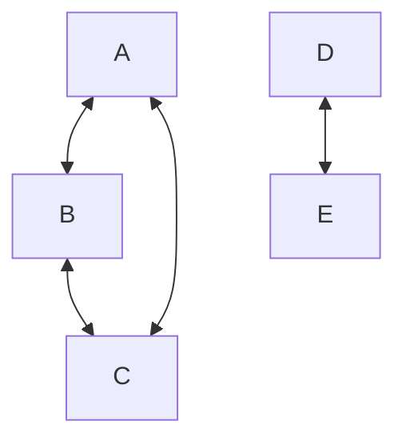

For an [[Graph#Undirected graphs|undirected graph]], a component is a set of [[Vertex|vertices]] in a [[Graph|graph]] which all mutually share [[Path (Graphs)|paths]], but do no share paths with any other vertices in the graph.

For a [[Graph#Directed graphs|directed graph]], 

## Properties

### Giant Component 

The giant component is the component of the graph with the largest proportion of vertices.

In the example graph below, the giant component would be the subgraph $[A,B,C]$

### Singleton

A singleton is a component consisting of just one vertex.

---
## References

1. 