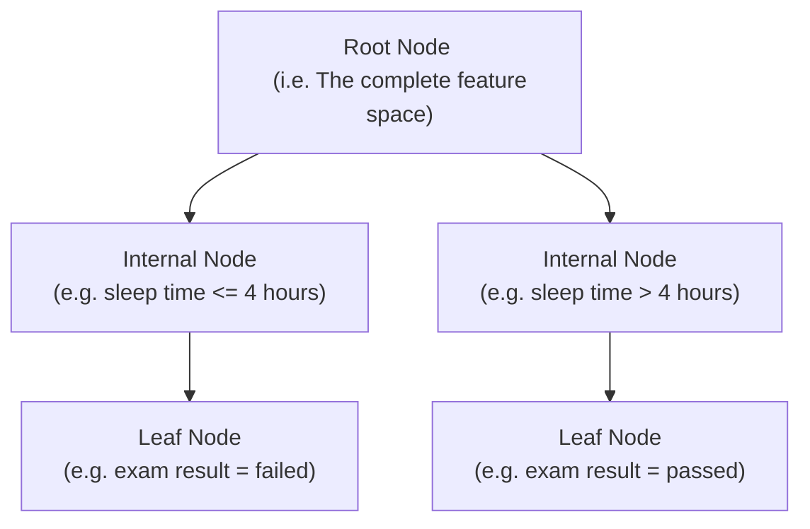

A decision tree is a [[Supervised Learning|supervised]] [[Machine Learning|machine learning]] [[Algorithms|algorithm]], used for both [[Classification Algorithms|classification]] tasks and continuous-output prediction tasks (e.g. [[Linear Regression|linear regression]]).

As the name implies, a decision tree constructs a [[Trees (Graph Theory)|tree-structure]] which outlines how the [[Feature Space|feature space]] should be split across numerous internal nodes over numerous layers.

This results in a set of leaf nodes containing all possible values of the outcome variable (in the case of classification), or some set of unique [[Arithmetic Mean|means]], each of which corresponds to a partition of the feature space with none of the feature space left unassigned (in the case of continuous-output prediction).

## Decision Tree Structure

The following is an example of the tree-structure for a decision-tree classifier with a single predictor variable (sleep time) and a binary outcome variable (exam result).

## Choosing Splitting Criterion for Internal Nodes

Choosing optimal splitting criterion for internal nodes involves minimising some [[Loss Function|loss function]] (or maximising an [[Objective Function|objective function]]).

For classification, we can choose splitting criterion which minimises [[Shannon Entropy|entropy]] (i.e. maximises [[Information Gain|information gain]]). Minimising entropy means selecting the feature and splitting criterion which pools as much of the data into one group as possible. We can similarly use [[Gini Impurity|Gini impurity]] as well.

For continuous-output prediction, we can use a loss function like [[Mean Squared Error|mean squared error (MSE)]] in a similar manner to entropy/information gain/Gini impurity. 

We first find the feature and splitting criterion which minimises the loss function. We then apply this recursively, repeating until all the data is grouped into all possible values of the outcome variable (or some set of distinct mean values in the case of continuous-output prediction).

---
## References

1. https://www.ibm.com/think/topics/decision-trees#684929710