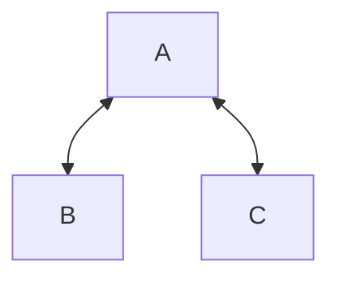

The number of [[Edge|edges]] on a [[Graph|graph]] which a [[Vertex|vertex]] has is called its degree, denoted $k_{i}$. The degree of a graph constitutes one possible measure of the centrality of a graph.

For the following graph, vertex $A$ has a degree of $2$, where as vertices $B$ and $C$ have a degree of $1$:

### In-degree and Out-degree

For a [[Graph#Directed graphs|directed graph]], vertices can have incoming edges and outgoing edges.

We can treat the degrees of these two types of edges separately:

 - In-degree (for incoming edges) 
 - Out-degree (for outgoing edges).

### Average degree

We can also determine the average degree for a graph by summing all the degrees of each vertex $\sum_{i}k_{i}$ and dividing by the number of vertices $N$:

$$
\langle k\rangle = \frac{\sum_{i}k_{i}}{N}
$$

Which can also be determined by the [[Density (Graphs)|density]] $d$ of the graph:

$$
\langle k \rangle = d(N-1)
$$

### Excess degree

We can consider travelling to a vertex from another [[Connectedness (Graphs)|connected]] vertex and observing how many edges that vertex has, excluding the edge we just travelled on.

This is given by:

$$
d^{'} = k_{i}-1
$$

---
## References

1. 