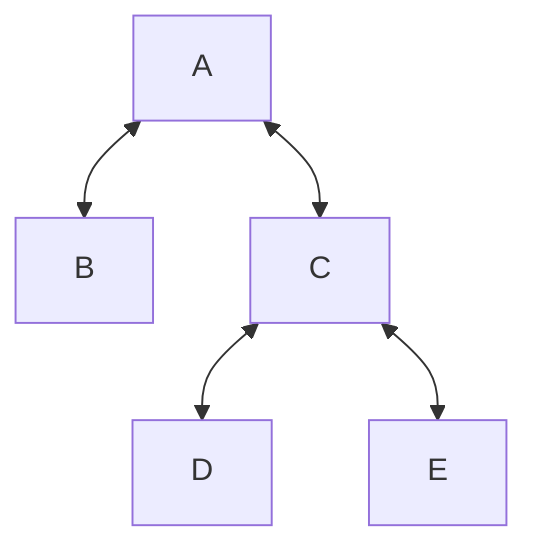
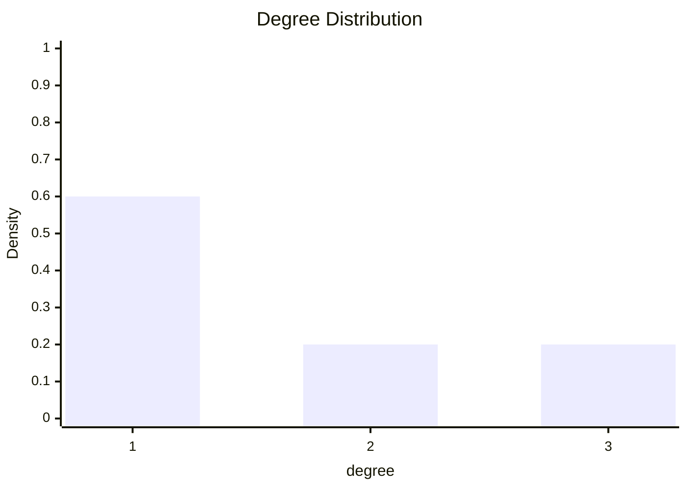

A given [[Graph|graph]] will have some number of [[Vertex|vertices]] $V$, each with a [[Degree (Graphs)|degree]] $k_{i}$.

We can therefore consider the overall distribution of degrees in a graph but counting the number of vertices which have some degree $k$, for all vertices in the graph.

## Example

For example, we can consider the following graph:

We can therefore construct a degree distribution for this graph:

For realistic graphs, we would tend to expect the distribution to resemble an [[Exponential Distribution|exponential distribution]]. 

## [[Degree Heterogeneity]]

We can consider how broad the degree distribution is by evaluating its heterogeneity.

$$
\kappa =\frac{\langle k^{2} \rangle}{\langle k \rangle^{2}}
$$

Where:

 - $\displaystyle\langle k \rangle=\frac{\sum_{i}k_{i}}{N}=\frac{2L}{N}$
 - $\displaystyle\langle k^{2} \rangle=\frac{\sum_{i}k_{i}^{2}}{N}$

---
## References

1. 