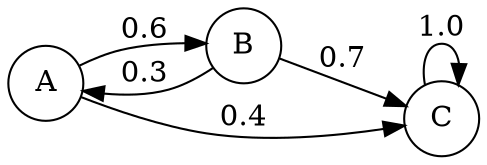

A discrete-time [[Markov Chain|Markov chain]] is a type of Markov chain where each time step is discrete rather than moving continuously as with [[Continuous-Time Markov Chains|continuous-time Markov chains]].

It is often the case that we want our Markov chains to be finite, [[Discrete-Time Markov Chains#Irreducibility|irreducible]] and [[Discrete-Time Markov Chains#Aperiodicity|aperiodic]] as this enables the chain to converge to a unique [[Stationary Distribution|stationary distribution]].

## Notation

$$
p_{i,j}^{(k)}=\mathbb{P}(X_{t+k}=j~|~X_{t}=i)~~~~~\forall i,j \in \mathcal{S}
$$

## [[Graph]] Representation

We can represent Markov chains using graphs. Each [[Vertex|vertex]] corresponds to a state in our Markov chain and each [[Edge|edge]] is the probability of moving from state $i$ to state $j$.

## Properties

### Accessibility

A state $j$ is accessible to state $i$ if there exists a finite number of steps $k$ such that the probability of moving from state $i$ to state $j$ in $k$ steps is positive. In other words, accessibility means it is possible to reach $j$ from $i$ in some finite number of time steps.

$$
\inf \left\{k:p_{i,j}^{(k)}>0\right\} < \infty
$$

The above expression means: the [[Infimum|infimum]] of the set of all step numbers $k$ where it is possible to move from state $i$ to $j$ is less than infinity. 

Which means to say, consider all the possible $k$ time step paths between $i$ and $j$, then take the smallest time step and check if it is finite. If it is, then $j$ is accessible from $i$.

### Communication

Two states $i,j$ communicate if they are accessible from each other. 

$$
i \leftrightarrow j \Leftrightarrow i \to j ~\land~ j \to i~~~~~\forall i,j\in\mathcal{S}
$$

### Irreducibility

If all states are communicable from any other state, the Markov chain is said to be irreducible.

$$
\exists k : p_{i,j}^{(k)}>0~~~~~\forall i,j \in \mathcal{S}
$$

### Periodicity

The periodicity of an irreducible Markov chain is given by $D$, where $D$ is the greater common divisor of all the $k$-step [[Integers|integers]] where it is possible to return to $k$. 

$$
D=\gcd\left\{k \ge 1: p_{i,i}^{(k)}>0\right\}~~~~~\forall i \in \mathcal{S}
$$

#### Aperiodicity

If, for any $k$ it is possible to return to state $i$, then the greatest common divisor is $1$ and thus the Markov chain is aperiodic.

---
## References

1. 