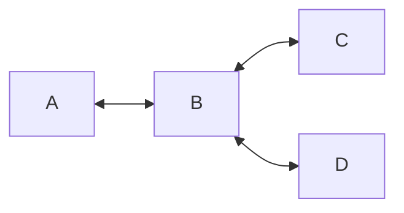
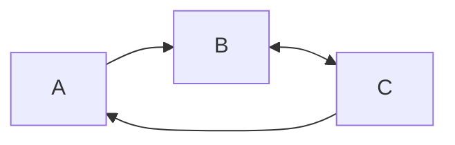
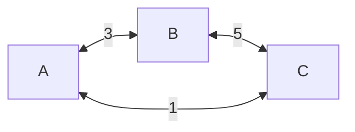
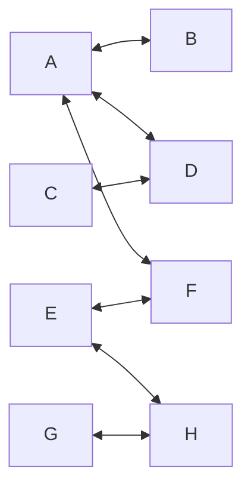

A graph is a way to represent relationships, involving [[Vertex|vertices/nodes]] and [[Edge|edges/links]]. 

## Notation

A graph $G$ with vertices $V$ and edges $E$ can be expressed as:

$$
G = (V,E)
$$

## Types of Graphs 

### Undirected graphs 

Undirected graphs are graphs where all edges can be traversed bi-directionally

### Directed graphs 

Directed graphs are graphs where at least 1 edge can only be traversed in one direction.

### Weighted graphs 

Weighted graphs are graphs where edges have some associated numerical value.

### Bipartite graphs 

Bipartite graphs are graphs which have two groups of nodes and edges can only be constructed between members of different groups.

Here, $A,C,E,G$ are one group and $B,D,F,H$ is another group.

### Trees 

A tree is an undirected graph where the deletion of a single edge would result in one or more nodes being [[Connectedness (Graphs)|disconnected]] from the graph.

A tree can also be defined as a [[Connectedness (Graphs)|connected]] graph without any [[Path (Graphs)#Cycles|path cycles]].

### Subgraph 

A subgraph is a subset of nodes in a graph, with all of the edges present between these nodes.

A complete subgraph is a called a clique.

---
## References

1. 