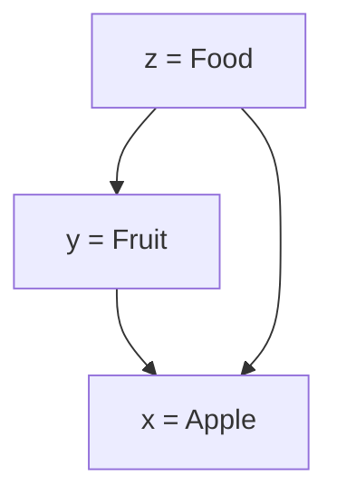

A hypernym is a word which refers to a broader class of concepts, that is it has at least 1 [[Hyponymy|hyponym]]

 - E.g. *animal* is a hypernym of *dog*

Hypernyms are transitive, meaning that if $z$ is a hypernym of $y$, and $y$ is a hypernym of $x$, then $z$ is also a hypernym of $x$

---
## References

1. 