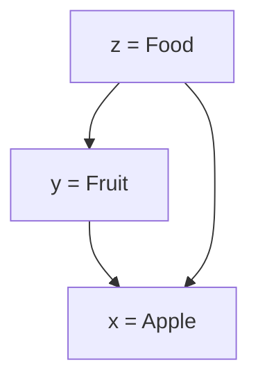
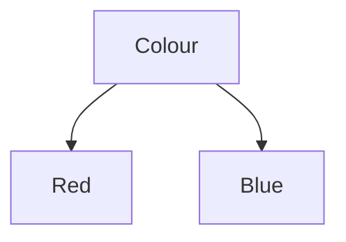

A hyponym is a word which part of a broader class of concepts (called [[Hypernymy|hypernyms]]).

 - E.g. *dog* is a hyponym of *animal*

Hyponyms are transitive, meaning that if $x$ is a hyponym of $y$, and $y$ is a hyponym of $z$, then $x$ is also a hyponym of $z$:

## Hyponym Hierarchies

Words which share a common hypernym are co-hyponyms. In the below example, *Red* and *Blue* are co-hyponyms as they both share *Colour* as a hypernym

We can use measures like [[WordNet#Path Length|path length]]

---
## References

1. 